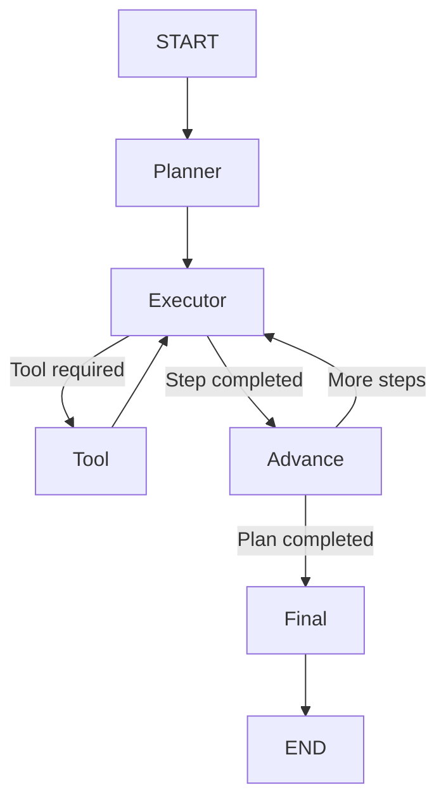

# Day 11 — LangGraph Workflow Migration

## Goal

The goal of Day 11 was to migrate the agent orchestration layer from a manually implemented workflow to LangGraph.

The existing components were kept unchanged:

- OllamaClient
- ToolRegistry
- RAGService
- ChromaVectorStore
- Session Memory
- Long-term User Memory
- FastAPI API layer

LangGraph is responsible only for controlling the agent workflow.

---

## Architecture

The current agent workflow is:

    User
      |
      v
    FastAPI
      |
      v
    Agent
      |
      v
    LangGraph
      |
      v
    START
      |
      v
    LLM Node
      |
      v
    Conditional Edge
      |
      +--------------------+
      |                    |
      | tool_calls         | no tool_calls
      v                    v
    Tool Node             END
      |
      v
    ToolRegistry
      |
      +--> Time Tool
      |
      +--> Weather Tool
      |
      +--> RAG Tool
             |
             v
          RAGService
             |
             v
           Chroma
      |
      v
    LLM Node

The main execution loop is:

    LLM -> Tool -> LLM -> ... -> END

---

## 1. LangGraph State

LangGraph uses a shared state that is passed between graph nodes.

```python
from typing import Any, TypedDict


class LangGraphState(TypedDict):
    # Store the conversation history shared across graph nodes
    messages: list[dict[str, Any]]

    # Store tool calls requested by the latest LLM response
    tool_calls: list[dict[str, Any]]

    # Track how many graph nodes have been executed
    step: int


## Day 12 - Planning and Multi-Step Agent Workflow

### Goal

Extend the LangGraph agent with explicit planning so that complex user
requests can be broken into multiple executable steps.

### Planning Workflow

The agent now follows this workflow:



### Agent State

The LangGraph state now contains planning information:

```python
class LangGraphState(TypedDict):
    messages: list[dict[str, Any]]
    tool_calls: list[dict[str, Any]]

    plan: list[str]
    current_step: int
    step_results: list[str]

    step: int
```

The main fields are:

- `plan`: execution steps generated by the Planner
- `current_step`: index of the next plan item to execute
- `step_results`: results produced by completed plan steps
- `messages`: complete execution history
- `tool_calls`: tool calls requested by the Executor
- `step`: number of graph node executions

### Planner Node

The Planner converts a complex user request into a short execution plan.

Example:

```text
User:
Check our annual leave policy and tell me the current time.

Plan:
1. Search the knowledge base for the annual leave policy
2. Get the current time
```

The Planner knows which tools are available but does not execute them.

### Executor Node

The Executor handles only the current plan item:

```text
plan[current_step]
```

It can request tools when required.

The Executor must not execute future plan steps.

### Tool Node

The Tool Node executes tool calls through `ToolRegistry`.

Tool validation, timeout handling, retry logic, and access control remain
inside the existing Tool Registry.

### Advance Node

When the current plan item is complete, the Advance Node moves to the next
item:

```python
current_step += 1
```

### Step Results

Completed plan results are stored separately:

```text
step_results
├── Annual leave: 15 days per year
└── Current time: 2026-09-21 00:35:18
```

This separates execution history from execution results:

```text
messages      = execution history
step_results  = completed task results
```

### Final Node

After all plan items are complete, the Final Node combines `step_results`
into one response for the original user request.

```text
Planner
   ↓
Executor
   ↓
Tool
   ↓
Executor
   ↓
Step Result
   ↓
Advance
   ↓
...
   ↓
Final
```

### Recursion Protection

Planning workflows can execute several graph nodes for one plan item.

Therefore:

```text
Plan Step != Graph Step
```

The agent uses a separate graph recursion limit to protect against infinite
workflow loops.

### Key Takeaways

- Planning breaks complex requests into explicit steps.
- Each Executor run focuses on one plan item.
- Tool execution does not automatically mean the plan item is complete.
- `step_results` stores clean outputs from completed steps.
- The Final Node combines all step results into the final answer.
- LangGraph controls orchestration while existing services such as
  ToolRegistry, RAG, Memory, and Ollama remain reusable.

  
Day 12 最核心的变化：
  START
  ↓
Planner
  ↓
Executor ←── Tool
  ↓
Advance
  ├──→ Executor
  └──→ Final → END