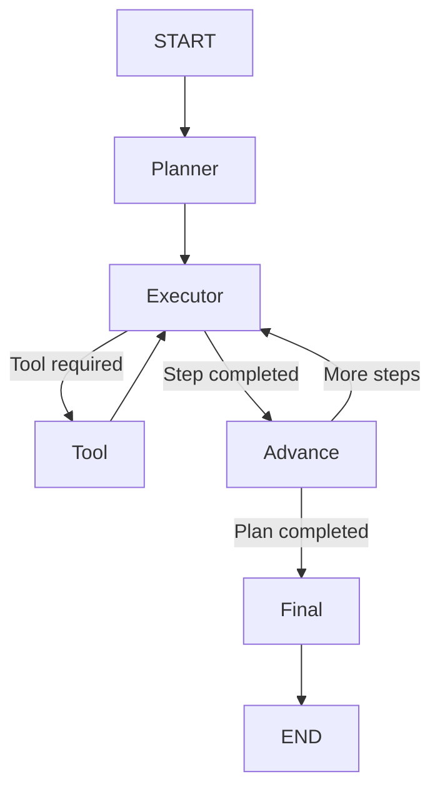

# Day 11 — LangGraph Workflow Migration

## Goal

The goal of Day 11 was to migrate the agent orchestration layer from a manually implemented workflow to LangGraph.

The existing components were kept unchanged:

- OllamaClient
- ToolRegistry
- RAGService
- ChromaVectorStore
- Session Memory
- Long-term User Memory
- FastAPI API layer

LangGraph is responsible only for controlling the agent workflow.

---

## Architecture

The current agent workflow is:

    User
      |
      v
    FastAPI
      |
      v
    Agent
      |
      v
    LangGraph
      |
      v
    START
      |
      v
    LLM Node
      |
      v
    Conditional Edge
      |
      +--------------------+
      |                    |
      | tool_calls         | no tool_calls
      v                    v
    Tool Node             END
      |
      v
    ToolRegistry
      |
      +--> Time Tool
      |
      +--> Weather Tool
      |
      +--> RAG Tool
             |
             v
          RAGService
             |
             v
           Chroma
      |
      v
    LLM Node

The main execution loop is:

    LLM -> Tool -> LLM -> ... -> END

---

## 1. LangGraph State

LangGraph uses a shared state that is passed between graph nodes.

```python
from typing import Any, TypedDict


class LangGraphState(TypedDict):
    # Store the conversation history shared across graph nodes
    messages: list[dict[str, Any]]

    # Store tool calls requested by the latest LLM response
    tool_calls: list[dict[str, Any]]

    # Track how many graph nodes have been executed
    step: int


## Day 12 - Planning and Multi-Step Agent Workflow

### Goal

Extend the LangGraph agent with explicit planning so that complex user
requests can be broken into multiple executable steps.

### Planning Workflow

The agent now follows this workflow:



### Agent State

The LangGraph state now contains planning information:

```python
class LangGraphState(TypedDict):
    messages: list[dict[str, Any]]
    tool_calls: list[dict[str, Any]]

    plan: list[str]
    current_step: int
    step_results: list[str]

    step: int
```

The main fields are:

- `plan`: execution steps generated by the Planner
- `current_step`: index of the next plan item to execute
- `step_results`: results produced by completed plan steps
- `messages`: complete execution history
- `tool_calls`: tool calls requested by the Executor
- `step`: number of graph node executions

### Planner Node

The Planner converts a complex user request into a short execution plan.

Example:

```text
User:
Check our annual leave policy and tell me the current time.

Plan:
1. Search the knowledge base for the annual leave policy
2. Get the current time
```

The Planner knows which tools are available but does not execute them.

### Executor Node

The Executor handles only the current plan item:

```text
plan[current_step]
```

It can request tools when required.

The Executor must not execute future plan steps.

### Tool Node

The Tool Node executes tool calls through `ToolRegistry`.

Tool validation, timeout handling, retry logic, and access control remain
inside the existing Tool Registry.

### Advance Node

When the current plan item is complete, the Advance Node moves to the next
item:

```python
current_step += 1
```

### Step Results

Completed plan results are stored separately:

```text
step_results
├── Annual leave: 15 days per year
└── Current time: 2026-09-21 00:35:18
```

This separates execution history from execution results:

```text
messages      = execution history
step_results  = completed task results
```

### Final Node

After all plan items are complete, the Final Node combines `step_results`
into one response for the original user request.

```text
Planner
   ↓
Executor
   ↓
Tool
   ↓
Executor
   ↓
Step Result
   ↓
Advance
   ↓
...
   ↓
Final
```

### Recursion Protection

Planning workflows can execute several graph nodes for one plan item.

Therefore:

```text
Plan Step != Graph Step
```

The agent uses a separate graph recursion limit to protect against infinite
workflow loops.

### Key Takeaways

- Planning breaks complex requests into explicit steps.
- Each Executor run focuses on one plan item.
- Tool execution does not automatically mean the plan item is complete.
- `step_results` stores clean outputs from completed steps.
- The Final Node combines all step results into the final answer.
- LangGraph controls orchestration while existing services such as
  ToolRegistry, RAG, Memory, and Ollama remain reusable.


Day 12 最核心的变化：
  START
  ↓
Planner
  ↓
Executor ←── Tool
  ↓
Advance
  ├──→ Executor
  └──→ Final → END


## Day 13 - Review and Replanning

### Goal

Improve the planning workflow so the agent can evaluate execution results
and dynamically adjust the remaining plan when a step fails.

### Workflow

```mermaid
flowchart TD
    START --> Planner
    Planner --> Executor

    Executor -->|Tool required| Tool
    Tool --> Executor

    Executor -->|Step completed| Reviewer

    Reviewer -->|Success| Advance
    Reviewer -->|Failed| Replanner

    Replanner --> Executor

    Advance -->|More steps| Executor
    Advance -->|Plan completed| Final

    Reviewer -->|Replan limit reached| Final

    Final --> END


Reviewer
The Reviewer evaluates whether the current plan step was completed
successfully.
It produces structured output containing:
- success
- feedback

Replanner
When a step fails review, the Replanner creates a new plan for the
remaining work while preserving already completed steps.
Replan Protection
The workflow tracks replan_count and limits the number of replanning
attempts.
LangGraph's recursion_limit provides an additional graph-level safety
mechanism.

Structured Output
Planner and Replanner use PlanResult.
Reviewer uses ReviewResult.
Pydantic models and Ollama JSON Schema output are used to validate 
structured LLM responses

.
Key Takeaways
- Execution results should be reviewed before advancing the plan.
- Failed steps can trigger dynamic replanning.
- Replanning and graph recursion limits solve different problems.
- Structured output is safer than relying on raw JSON text from an LLM.
- Successful tool results should be treated as authoritative execution
  results by the final response generator.


## Day 14 - LangGraph Checkpoint Persistence

### Goal

Add persistent workflow state to the LangGraph agent so workflow checkpoints can survive application restarts.

### What I Learned

- Difference between conversation persistence and workflow persistence
- LangGraph `thread_id` and checkpoint state
- `MemorySaver` stores checkpoints only in process memory
- Redis can persist LangGraph checkpoints across application restarts
- One conversation session can contain multiple independent workflow executions
- `session_id` and workflow `thread_id` have different lifecycles
- Shared async resources should be managed at the application level

### Architecture

```text
Conversation Persistence

Agent
  ↓
SessionManager
  ↓
Redis :6379
  ├── Conversation Messages
  └── Long-term User Memory


Workflow Persistence

Agent
  ↓
LangGraph
  ↓
AsyncRedisSaver
  ↓
Redis 8 :6380
  ↓
Workflow Checkpoints


```text
Redis :6379
→ Session + Long-term Memory

Redis 8 :6380
→ LangGraph Checkpoint


## Day 15 - Human-in-the-Loop and Workflow Resume

- Added LangGraph `interrupt()` for human approval
- Added workflow resume with `Command(resume=...)`
- Added `/chat/resume` API endpoint
- Added selective approval for destructive tools
- Added tool-level `requires_approval` metadata
- Added a second execution guard in ToolNode
- Added cross-process resume with Redis checkpoints
- Added tests for protected tool execution


### Structer
User Request
    ↓
Planner
    ↓
Check Tool Metadata
    ↓
requires approval?
   ↙            ↘
 No             Yes
 ↓               ↓
Executor      interrupt()
                 ↓
              Human
             ↙     ↘
          Reject  Approve
            ↓       ↓
          Final   Resume
                    ↓
                 Executor
                    ↓
              ToolNode Guard
                    ↓
              Actual Tool


## Day 16 - Agent Observability and Trace

- Added `AgentTrace` for workflow-level observability
- Added trace events for LangGraph node lifecycle:
  - `node_started`
  - `node_completed`
  - `node_failed`
- Added tool execution trace events:
  - `tool_called`
  - `tool_completed`
  - `tool_failed`
  - `tool_exception`
- Traced planner, executor, tool, reviewer, advance, replan, and final nodes
- Preserved trace data across LangGraph checkpoint resume
- Verified trace restoration across process restarts
- Avoided storing tool arguments and full tool results in trace events
- Added unit tests for `AgentTrace`


HTTP request
     ↓
request_id
     ↓
Agent Workflow
     ↓
thread_id + AgentTrace
     ↓
Planner → Executor → Tool → Reviewer → Final


## Day 17 - Agent Evaluation

- Added `EvalCase` and `EvalResult` models
- Added deterministic evaluation logic for expected vs actual agent behavior
- Added real Agent evaluation runner
- Reused `AgentTrace` to inspect planner tool selection
- Added evaluation cases for:
  - Time tool selection
  - RAG tool selection
  - Human approval for destructive tools
- Added real Agent evaluation tests using `MemorySaver`
- Added the `eval` pytest marker to separate slow LLM evaluations from fast unit tests
- Verified Agent evaluations without executing protected tools before approval


## Day 18 - Agent Reliability
Deterministic facts → Code; Semantic judgment → LLM.

- Improved reviewer reliability by separating deterministic tool status from semantic task evaluation
- Added `last_tool_success` to workflow state
- Added deterministic fast-fail behavior for failed tool executions
- Reset tool execution status when advancing or replanning
- Fixed stale workflow state after replanning
- Removed unnecessary `step_success` updates from the replanner
- Added aggregated status handling for multiple tool calls
- Added reviewer, replanner, and tool-node reliability tests
- Verified real Agent evaluation without unnecessary replanning for successful time-tool execution


## Day 19 - Agent Guardrails and Output Validation

- Added deterministic final output validation
- Added `InvalidAgentOutputError` for invalid agent responses
- Rejected empty, non-string, and excessively large final outputs
- Extracted output validation into a dedicated `guardrails` module
- Added trace events for final output validation failures
- Treated tool and RAG results as untrusted data rather than instructions
- Added prompt-injection boundaries to Executor and Final prompts
- Kept tool permissions and human approval as deterministic security boundaries
- Added unit tests for final output validation and guardrail behavior