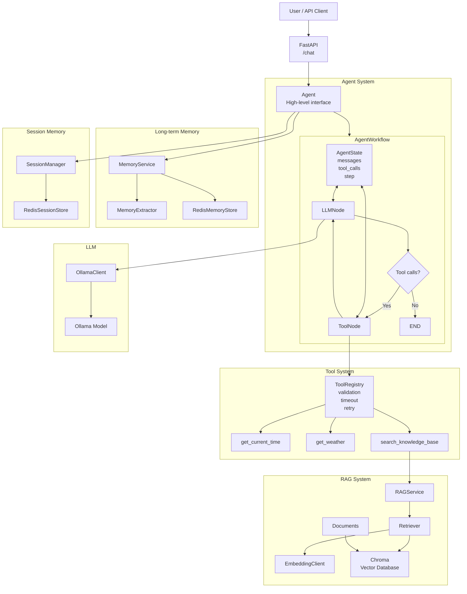

## Current Features

### Agent
- Async agent loop with Ollama
- Tool calling
- Tool registry with automatic JSON schema generation
- Tool timeout and retry handling
- Tool groups / capability control

### Conversation Memory
- Session-based conversation history
- Redis persistence
- Memory trimming
- Session isolation

### RAG
- Document loading and chunking
- Ollama embeddings with `nomic-embed-text`
- Chroma persistent vector store
- Cosine similarity search
- Top-K retrieval
- Score threshold filtering
- Source metadata tracking
- RAG service
- RAG exposed as an Agent tool

### Long-term Memory
- User-based persistent memory
- Separate `user_id` and `session_id`
- Automatic memory extraction from user messages
- Cross-session memory
- Memory update and merge
- Explicit memory forgetting
- Per-user concurrency lock
- Redis persistence
- Long-term memory and RAG separation

Before

Agent.run()
├── LLM
├── Tool detection
├── Tool execution
├── Loop
├── max_steps
└── Return

After

Agent
  ↓
AgentWorkflow
  ↓
AgentState
  │
  ├── messages
  ├── tool_calls
  └── step
  ↓
LLMNode
  ↓
tool_calls?
 ├── No  → END
 └── Yes → ToolNode
              ↓
          ToolRegistry
              ↓
           LLMNode
## Architecture

